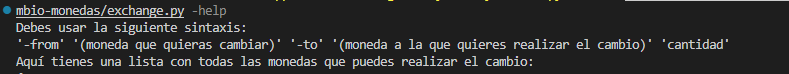
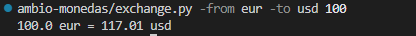

# Conversor de divisas en Python

Este proyecto implementa un **conversor de divisas** en Python que permite cambiar un monto de una moneda a otra usando datos en tiempo real de una **API pública de divisas**. 

## Descripción
Este proyecto consiste en cambiar una cantidad de una moneda a otra usando una API externa.

El proyecto ha sido desarrollado como práctica académica.

## Funcionalidades
- Conversión de divisas en tiempo real.
- Validación de monedas introducidas.
- Mensajes claros de error si los parámetros o monedas son incorrectos.
- Modo de ayuda para mostrar la sintaxis y las monedas disponibles.
- Cálculo y despliegue del resultado con 2 decimales.

## Tecnologías utilizadas
- Lenguaje: Python
- Entorno de desarrollo: Visual Studio Code

## Instrucciones de uso
1. Ejecutar el archivo con nombre: "exchange.py"
2. Si no sabe cuál es la sintaxis que debe usar para empezar a realizar los cambios use "-help"

## Capturas de pantalla

Ayuda para usar la aplicación:

Ejemplo de uso de la aplicación:

