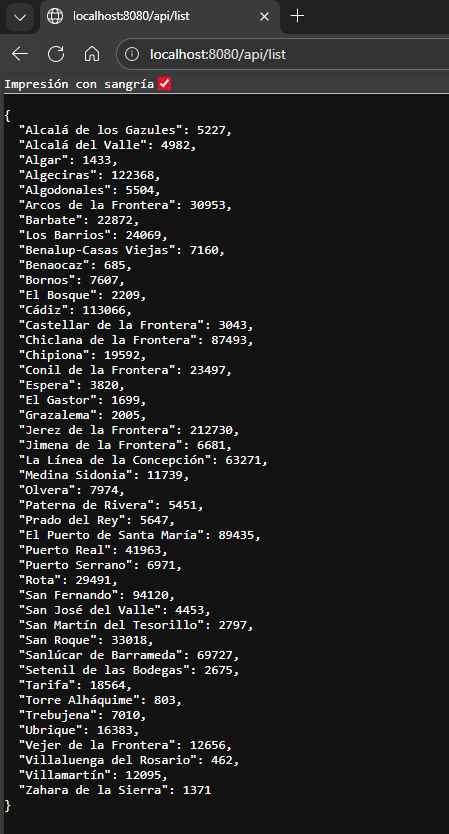
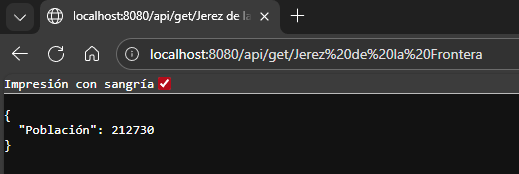

# API de Municipios en Python

Este proyecto implementa un **servidor HTTP básico** en Python que proporciona información sobre municipios de Cádiz y su población. La aplicación permite:
- Listar todos los municipios con su población.
- Consultar la población de un municipio específico mediante una API REST sencilla.

## Descripción
Este proyecto consiste en poder consultar la población de cada municipio mediante un servidor API.

El proyecto ha sido desarrollado como práctica académica.

## Funcionalidades
- Listado completo de municipios con población.
- Consulta individual de población de un municipio.
- Respuesta en formato **JSON** con codificación UTF-8.
- Manejo básico de rutas y errores HTTP.
- Servidor accesible desde cualquier IP (`0.0.0.0`) en el puerto `8080`.

## Tecnologías utilizadas
- Lenguaje: Python
- Entorno de desarrollo: Visual Studio Code

## Instrucciones de uso
1. Ejecutar el archivo con nombre: "servidor_restapi.py".
2. Para consultar los municipios disponibles usar un navegador o el cliente proporcionado.
3. Una vez en el navegador usar **/api/list** para mostrar todos los municipios (en el cliente solo se puede escribir el nombre del municipio y te muestra la población directamente).
4. Una vez tengas el nombre del municipio que quieres buscar usa /api/get/'nombre del municipio' para saber la población solo de ese municipio.

## Capturas de pantalla

Listado de todos los municipios:

Ejemplos de solo un municipio:

Ejemplos de solo un municipio pero con el cliente:

