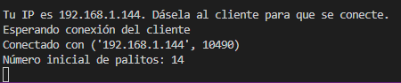
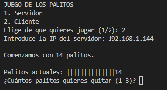
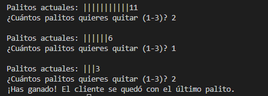
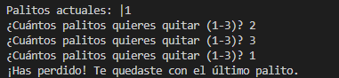

# Juego de los palitos

Juego de palitos donde dos jugadores, uno hace de servidor y otro de cliente, tiene que jugar al juego de los palitos.

## Descripción
Este juego consiste en que ambos jugadores tiene que ir quitando palitos, entre 1 y 3 palitos por ronda. El jugador que quite el último palito pierde la partida.

El proyecto ha sido desarrollado como práctica académica.

## Funcionalidades
- Generación aleaotria del número inicial de palitos (entre 10 y 20).
- Control de turnos entre servidor y cliente.
- Validación de entradas del usuario (solo permite 1, 2 o 3 palitos)
- Cierre correcto de la conexión al finalizar.

## Tecnologías utilizadas
- Lenguaje: Python
- Entorno de desarrollo: Visual Studio Code

## Instrucciones de uso
1. Ejecutar el archivo con nombre: "palitos.py"
2. Seleccionar de que quiere jugar
3. Compartir la IP o escribir la IP del servidor
4. Comenzar a jugar

## Capturas de pantalla

Inicio Servidor:

Inicio Cliente:

Durante el juego:

Final:

